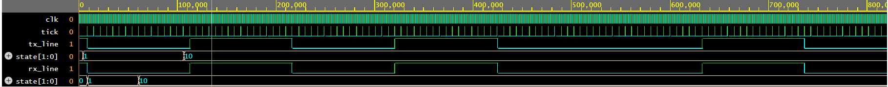
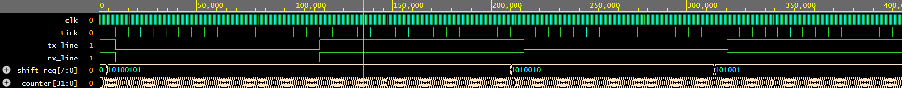
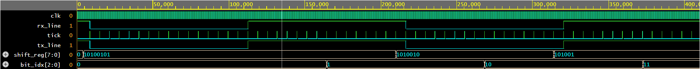
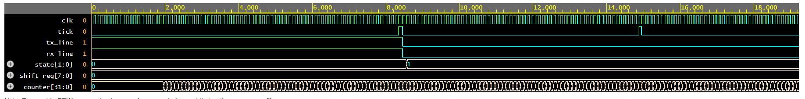

# UART Transmitter & Receiver with x16 Tick Oversampling and Loopback (Verilog HDL)
<a id="sec-author"></a>

**Author:** Rom Barak  
**Institution:** Bar-Ilan University  
**Focus:** Nanoelectronics and Communication Systems  

This project implements a complete **UART (Universal Asynchronous Receiver/Transmitter)** system in **Verilog HDL**, designed and verified using a **fully deterministic loopback configuration**.

The design includes a **baud-rate tick generator**, **UART transmitter (TX)**, **UART receiver (RX)**, **top-level loopback integration**, and a **self-checking testbench**.  
All modules are synchronized using a shared **x16 baud-rate tick**, enabling precise **half-bit alignment** and bit-accurate reconstruction with **zero mismatches** in simulation.

---

## Table of Contents
- [Author](#sec-author)
- [Introduction](#sec-intro)
- [System Overview](#sec-overview)
- [Timing and Synchronization](#sec-timing)
- [Baud Rate Configuration](#sec-baud)
- [Frame Format](#sec-frame)
- [Module Descriptions](#sec-modules)
- [Simulation and Waveforms](#sec-waves)
- [Results](#sec-results)
- [Design Insights](#sec-insights)
- [Future Improvements](#sec-future)
- [License](#sec-license)

---
<a id="sec-intro"></a>
## Introduction

This project demonstrates a reliable UART design optimized for **cycle-accurate timing analysis and verification**.  
The system follows the **8N1** UART format (8 data bits, no parity, 1 stop bit) and operates using a **10 MHz system clock** with a **9600 bps baud rate**.

Instead of advancing directly at the baud rate, the design generates a **tick at 16× the baud rate**.  
Each UART bit is held for **16 ticks**, allowing the receiver to align sampling to the **center of each bit** using deterministic timing rather than majority voting.

The entire system is verified through an internal **TX→RX loopback**, eliminating dependency on external UART hardware.

---
<a id="sec-overview"></a>
## System Overview

The UART system consists of three main hardware blocks:

1. **Baud Generator (`baud_gen.v`)**  
   Generates a 1-cycle-wide timing pulse (`tick`) at **BAUD_RATE × 16**.

2. **UART Transmitter (`uart_tx.v`)**  
   Serializes data into start, data, and stop bits, holding each bit for 16 ticks.

3. **UART Receiver (`uart_rx.v`)**  
   Detects the start bit, aligns to its midpoint, and samples data bits on a fixed 16-tick cadence.

These modules are connected in **`uart_top.v`**, where the transmitter output is internally looped back to the receiver input, enabling full closed-loop verification.

Both TX and RX are driven by the **same tick**, ensuring deterministic synchronization at the bit level.

---
<a id="sec-timing"></a>
## Timing and Synchronization

**Default configuration:**
- **System Clock:** 10 MHz  
- **Baud Rate:** 9600 bps  
- **Oversampling Tick Rate:** 153.6 kHz (9600 × 16)

The baud generator produces a **single-cycle pulse** (`tick`) every:DIVISOR = CLK_FREQ / (BAUD_RATE × 16)


Each UART bit spans **16 ticks**.

### Receiver Alignment
- RX detects the falling edge of the start bit.
- It waits **7 ticks** to reach the midpoint of the start bit.
- Data bits are then sampled every **16 ticks**, ensuring mid-bit alignment.
- Stop bit validation completes the frame.

This approach provides stable sampling without majority voting while remaining fully deterministic.

---
<a id="sec-baud"></a>
## Baud Rate Configuration

Baud-rate configuration is defined in **`baud_gen.v`**:

```verilog
parameter CLK_FREQ  = 10_000_000;  // System clock frequency [Hz]
parameter BAUD_RATE = 9600;        // Target baud rate [bps]

localparam integer DIVISOR = CLK_FREQ / (BAUD_RATE * 16);

```
> **Important:**  
> - The same clock frequency and baud rate must be used across all modules.  
> - If you change the baud rate, you **must also modify timing-related delays in the testbench (`uart_tb.v`)** -  
>   specifically, the wait durations between transmitted bytes (`#2000`, `wait(rx_done)`, etc.), so that they correspond to the new bit period.  
> - For best simulation stability, it is recommended to keep the default configuration: **50 MHz / 9600 bps**.

This is the frequency ratio that the entire project was verified and tuned with.

---
<a id="sec-frame"></a>
## Frame Format
Each transmitted UART frame contains **10 bits total**:
| Segment | Bits | Description |
|----------|------|-------------|
| Idle | 1 | Line held high (`1`) |
| Start Bit | 1 | Logic low (`0`) to begin frame |
| Data Bits | 8 | Sent LSB first |
| Stop Bit | 1 | Logic high (`1`) to end frame |

**Frame Example:**  
`Idle (1)` → `Start (0)` → `b0 b1 b2 b3 b4 b5 b6 b7` → `Stop (1)`  

This follows the 8N1 UART convention.

---
<a id="sec-modules"></a>
## Module Descriptions
<a id="sec-baud-gen"></a>
### **1. Baud Generator – `baud_gen.v`**
Generates the shared x16 timing tick.
When the internal counter reaches `DIVISOR - 1`, a one-clock-cycle `tick` pulse is asserted and the counter resets.

**Purpose:** Ensures both transmitter and receiver progress through each bit period in exact lockstep.

---
<a id="sec-uart-tx"></a>
### **2. UART Transmitter – `uart_tx.v`**
Implements the transmit-side FSM with four states:
- **IDLE:** Line is high; waits for `tx_start` trigger.  
- **START:** Start bit held for 16 ticks.
- **DATA:** 8 data bits, each held for 16 ticks (LSB first).
- **STOP:** Stop bit held for 16 ticks.

When `tx_start` is asserted, the module latches the byte into a shift register and sets `tx_busy` high until all bits are transmitted.

This FSM guarantees consistent bit timing and correct framing.

---
<a id="sec-uart-rx"></a>
### **3. UART Receiver – `uart_rx.v`**
The receiver mirrors the TX FSM with four states:
- **IDLE:** Monitors line for a falling edge (start bit).  
- **START:** 7-tick half-bit alignment.
- **DATA:** Samples each bit every 16 ticks.  
- **STOP:** Validates stop bit and asserts rx_done.

This design achieves accurate mid-bit sampling without oversampling, purely based on timing alignment from the shared tick.

---
<a id="sec-top"></a>
### **4. Top-Level Integration – `uart_top.v`**
Connects all modules into a complete UART system.  
The TX line is internally looped to the RX input, allowing closed-loop validation.  
This configuration verifies all timing, synchronization, and FSM behavior within one simulation environment.

---
<a id="sec-tb"></a>
### **5. Verification Testbench - `uart_tb.v`**
A self-checking testbench that automates:
- Clock generation (10 MHz)
- Reset sequencing  
- Transmission of multiple bytes  
- Waiting for `rx_done` pulses  
- Comparing transmitted vs received bytes  

**Test sequence:**  
`A5`, `3C`, `FF`, `00`, `55`  

Each transaction is logged using `$display`, verifying byte-for-byte integrity.  
A VCD waveform (`uart_loopback.vcd`) is generated for visual inspection.

---
<a id="sec-waves"></a>
## Simulation and Waveforms
This waveforms was captured using a 10MHz system clock and UART baud rate of 9600 bps.  
Waveforms show:
- The shared `tick` signal aligning TX and RX
   
- The RX’s half-bit delay for mid-bit sampling
      
- The FSM transitions (`IDLE → START → DATA → STOP`)
      
- Perfect data reconstruction with no mismatches
       

---
<a id="sec-results"></a>
## Results
- 100% match between transmitted and received bytes  
- TX and RX perfectly synchronized under shared tick control  
- Verified stable half-bit sampling with no timing drift  
- Zero timing drift in loopback verification. 
- Clean stop-bit recognition and proper idle-state recovery  

This confirms full functional correctness and timing reliability.

---
<a id="sec-insights"></a>
## Design Insights
- A shared x16 tick provides deterministic UART timing. 
- Half-bit alignment ensures sampling at maximum signal stability.
- FSM-based control enables cycle-accurate debugging.
- Loopback integration simplifies verification and timing validation.

The combination of shared timing, FSM separation, and internal loopback produces a robust and verifiable UART implementation.

---
<a id="sec-future"></a>
## Future Improvements

The current UART system operates accurately in a full loopback configuration, but several engineering enhancements could extend its functionality and robustness for real-world applications:

- **Parity Bit (Even/Odd)**  
  Adds a basic error detection mechanism by appending an extra control bit after the data bits. Useful for detecting transmission errors over long or noisy lines.

- **Two Stop Bits**  
  Introduces an additional idle period between frames, improving synchronization and tolerance to clock mismatch between transmitter and receiver.

- **Runtime Baud Rate Selection**  
  Allows dynamic adjustment of the baud rate by replacing the `parameter BAUD_RATE` with a writable control register.  
  When changing the baud rate, make sure to also update timing-related parameters in `baud_gen.v` and the `repeat` delays in `uart_tb.v`.

- **FPGA I/O Integration (External UART Interface)**  
  Connecting the TX/RX signals to physical FPGA pins enables real serial communication with PCs, microcontrollers, or other devices, facilitating hardware-level verification.
---
<a id="sec-license"></a>
## License
Released under the **MIT License**.  
Free for academic, research, and educational use.
